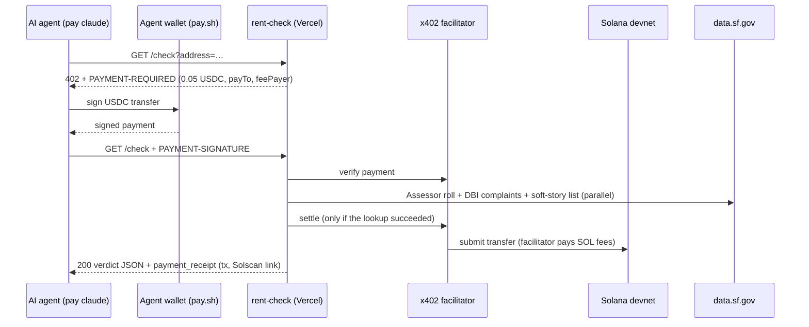

# rent-check

**City records for renters, sold to AI agents for 5 cents a call.**

An AI agent sends a San Francisco address, pays **$0.05 in USDC on Solana** via [x402](https://x402.org), and gets back whether the building is rent-controlled, its legal unit count, its real size and red flags from building complaints. There's no API key, no account and no sign-up: the agent pays per request, on its own.

[](https://www.youtube.com/watch?v=gvvUIVtCrL4)

▶ **Demo video:** https://www.youtube.com/watch?v=gvvUIVtCrL4
🌐 **Live API (Solana devnet):** https://rent-check-eight.vercel.app

---

## The problem

A rental listing shows photos, a price and a square footage. A renter actually needs to know three things the listing never says:

1. **Is the unit rent-controlled?** In San Francisco that decides whether the rent can rise by 1–2% a year or by any amount.
2. **Is it as big as advertised, and is it a legal unit?** Inflated square footage and unpermitted in-law units are common.
3. **Does the building have a history of problems?** Broken heat, mold, sewage leaks, a dead elevator, or complaints the landlord never fixed.

All of this is in **public city records**, but it's spread across several databases in formats that are hard to use, even for an AI agent. The Assessor roll doesn't say "1423 Kearny St". It says `1423 1413 KEARNY              ST0000`: a house-number range, a padded street name, a suffix code and a unit field.

## The solution

rent-check turns those records into **one reliable answer that any agent can buy on its own**:

```text
Agent → GET /check?address=300 Anzavista Ave
API   → 402 Payment Required: $0.05 USDC on Solana
Agent → signs the payment with its own wallet and retries
API   → 200 OK: verdict + evidence + Solana receipt
```

Example verdict (live data):

> ⚠ Size looks inflated: listing says 700 sq ft, city records suggest under 640. Rent-controlled: likely. 8 units. ⚠ Red flags: mold (2023), sewage / flooding / leaks (2001–2020), structural damage (2018, 2019). ⚠ 2 complaints open since 2018, never closed. Soft-story retrofit: complete. Paid 0.05 USDC on Solana devnet, Solscan receipt: https://solscan.io/tx/…

## Why an agent would pay: measured

We gave the same question about the same apartment to the same Claude model twice: once with rent-check, and once researching from scratch with only web and public-data tools.

| | **Claude + rent-check** | **Claude from scratch** | |
|---|---|---|---|
| Time to answer | **19 s** | 119 s | **6× faster** |
| API cost of the run | **$0.19** (incl. the $0.05 fee) | $0.56 | **3× cheaper** |
| Agent steps | **3** | 14 | **5× fewer** |

Both answers were correct. The difference is that rent-check did the research once, and every agent reuses it for 5 cents. *(Measured Sep 30, 2026 with Claude Code, `--output-format json`, Claude Opus 5.5. Cost is Claude Code's reported `total_cost_usd`. One run each.)*

## Try it with a real AI agent

The demo uses [**pay.sh**](https://github.com/solana-foundation/pay) from the Solana Foundation. It gives Claude Code its own stablecoin wallet and handles x402 payments automatically.

```bash
npm install -g @solana/pay     # or: brew install pay
pay setup                      # creates the agent's wallet
# fund the devnet wallet with test USDC at https://faucet.circle.com (network: Solana Devnet)
mkdir -p ~/renter && cd ~/renter && pay claude
```

Then ask:

```text
I'm about to rent 300 Anzavista Ave, San Francisco, listed as 700 sq ft. Is it rent-controlled,
how big is it really, and are there any red flags in city building complaints?
There's a paid API: https://rent-check-eight.vercel.app/check?address=<address> ($0.05 via x402).
Use your pay tools. At the end provide a link to Solanascan receipt.
```

Claude calls the API, gets the 402, pays 5 cents from its wallet, and answers with the evidence and a Solscan receipt. No human approves the payment.

### Demo addresses

| Address | What city records show |
|---|---|
| **640 28th Ave** (Outer Richmond) | Legally 5 units, rent-controlled. A 2012 complaint: "Illegal unit in back of bldg… 6 electrical meters for a 5 unit bldg." |
| **1300 26th Ave** (Sunset) | 29 units, rent-controlled. 36 complaints; the elevator has been down since September 2026. |
| **1777 Pine St** (Lower Pacific Heights) | 39 units, retrofit done. Black-water flood (2025), sewer gas (2023), mold (2022), ceiling collapse (2021). |
| **300 Anzavista Ave** (listed as 700 sq ft) | 8 units in 5,120 sq ft, so about 640 sq ft each including hallways. 2 complaints open since 2018: exposed wires, broken heater, bad locks. |
| **130 5th Ave** (Inner Richmond) | 6 units, rent-controlled, only routine inspections. The clean pass: the tool doesn't flag everything. |

---

## Technical description

### Architecture



| Layer | Technology |
|---|---|
| API server | Node.js, Express, deployed as a Vercel serverless function (`api/index.js`) |
| Payments | x402 v2 (`@x402/express`, `@x402/svm`, `@x402/core`), scheme `exact`, $0.05 USDC |
| Network | Solana devnet (`solana:EtWTRABZaYq6iMfeYKouRu166VU2xqa1`). Mainnet support exists behind `MAINNET=1`, using the PayAI facilitator |
| Facilitator | `https://x402.org/facilitator`. It verifies and settles payments and pays the SOL fees, so agents only hold USDC |
| Data | San Francisco open data (Socrata SoQL), live, with no API key |
| Agent client | pay.sh (`pay claude`, MCP tool `mcp__pay__curl`), or the included `@x402/fetch` buyer script |

### Payment flow details

- **402 challenge:** an unpaid `GET /check` returns HTTP 402 with a base64 `PAYMENT-REQUIRED` header: x402 version 2, scheme `exact`, amount `50000` (0.05 USDC, 6 decimals), asset `4zMMC9srt5Ri5X14GAgXhaHii3GnPAEERYPJgZJDncDU` (devnet USDC), `payTo` = the seller wallet, `extra.feePayer` = the facilitator.
- **Pay only for success:** settlement runs after the handler. If the address is missing (400) or the city data is unreachable (502), nothing settles and the agent isn't charged.
- **Receipt in the body:** x402 normally returns the settlement only in the `PAYMENT-RESPONSE` header, which many agent tools never show the model. rent-check copies it into the JSON as `payment_receipt` (transaction, payer, Explorer and Solscan links) and appends the Solscan link to `verdict`, so agents always show a receipt.
- **Hardening:**
  - `HEAD /check` is blocked so the paid handler can't run unpaid.
  - The facilitator's `/supported` lookup is retried on cold starts.
  - The seller only needs its public address on the server. No private key is deployed.

### Data pipeline (`src/data.js`)

1. **Address parsing:** free text ("300 anzavista avenue, San Francisco, CA 94115", "372 7th Ave Apt 5", "Nineteenth Ave") becomes a house number, a normalized street, the suffix, the unit and an optional listing size ("listed as 700 sq ft" or `?sqft=700`).
2. **Parcel match** in the Assessor secured roll (`wv5m-vpq2`, latest roll year):
   - It filters by street on the server, then matches the house number inside number ranges such as `0314 0300 ANZAVISTA AV`, preferring the same side of the street.
   - It handles both forms of numbered streets (`03RD AV` / `3RD ST`).
   - It aggregates condo buildings that are stored as many parcels.
3. **Complaints:** the building's full DBI history (`gm2e-bten`), matched by parcel, and by block plus street number for condo lots. Routine inspections are separated from real problems. It also counts open complaints and when the oldest one was filed.
4. **Red-flag engine:** keyword rules over the cleaned complaint text in 13 categories:
   - illegal units, mold, sewage/flooding/leaks, structural damage, elevator, heat/hot water, electrical, fire/safety, pests, locks/security, accessibility, unpermitted work, construction disruption.
   - Ranking: illegal units first, then anything from the last two years, then the rest by severity. A flag is skipped when it only repeats complaints already shown.
   - Phone numbers and emails are redacted.
5. **Soft-story retrofit status** from the city's earthquake-retrofit list (`beah-shgi`).
6. **Rules:**
   - SF Rent Ordinance: built before June 13, 1979 with 2 or more units means **likely** rent-controlled.
   - Costa-Hawkins: single-family homes and condos are exempt from increase limits.
   - Post-1979 buildings are noted as **AB 1482** (the California statewide cap), where it applies.
7. **Listing checks:**
   - *Unit check:* a unit number higher than the legal unit count flags a possible unwarranted unit.
   - *Size check:* building sq ft ÷ units gives an upper bound per unit, including hallways.
8. **Verdict:** one plain-English line with the three most relevant flags, plus the full evidence as JSON.

A lookup takes about 0.5–1.5 s; complaints and soft-story are fetched in parallel.

### API

| Endpoint | Price | Response |
|---|---|---|
| `GET /check?address=…[&sqft=700]` | $0.05 USDC via x402 | verdict JSON (below) |
| `GET /health` | free | `{"ok":true}` |
| `GET /` | free | service description |

<details>
<summary>Example response (300 Anzavista Ave, listed as 700 sq ft)</summary>

```json
{
  "address_query": "300 Anzavista Ave",
  "found": true,
  "matched_address": "300-314 Anzavista Ave",
  "parcel": "1104014",
  "year_built": 1952,
  "units": 8,
  "use": "Multi-Family Residential",
  "zoning": "RM1",
  "rent_control": { "status": "likely", "reason": "Built in 1952, before June 13, 1979, with 8 units: likely covered by the SF Rent Ordinance (rent-increase limits and just-cause eviction)." },
  "unit_check": { "claimed_unit": null, "legal_units": 8, "flag": false, "note": "No unit in the query." },
  "size_check": { "claimed_sqft": 700, "building_sqft": 5120, "avg_unit_sqft_incl_common": 640, "flag": true,
    "note": "Listing says 700 sq ft. City records: 5,120 sq ft building ÷ 8 units ≈ 640 sq ft each including hallways, so a typical unit is about 540–600 sq ft." },
  "complaints": { "total": 14, "problems": 14, "open": 2, "open_since": "2018-02-26",
    "open_items": [{ "date": "2018-03-13", "description": "Maintenance issues through-out common areas" }],
    "latest": [{ "date": "2023-07-06", "status": "Not Active", "description": "No heat, egress window is painted shut, peeling paint, mold/mildew." }] },
  "red_flags": [
    { "category": "mold", "label": "mold", "count": 1, "latest_date": "2023-07-06", "years": "2023",
      "examples": [{ "date": "2023-07-06", "description": "No heat, egress window is painted shut, peeling paint, mold/mildew." }] },
    { "category": "water_sewage", "label": "sewage / flooding / leaks", "count": 4, "latest_date": "2020-02-04", "years": "2001–2020",
      "examples": [{ "date": "2020-02-04", "description": "Plumbing leak to the downstair unit #308" }] }
  ],
  "soft_story": { "on_list": true, "status": "Work Complete, CFC Issued", "retrofit_complete": true, "tier": "3" },
  "verdict": "⚠ Size looks inflated: listing says 700 sq ft, city records suggest under 640. Rent-controlled: likely. 8 units. ⚠ Red flags: mold (2023), sewage / flooding / leaks (2001–2020), structural damage (2018, 2019). ⚠ 2 complaints open since 2018, never closed. Soft-story retrofit: complete. Paid 0.05 USDC on Solana devnet, Solscan receipt: https://solscan.io/tx/…?cluster=devnet",
  "sources": ["SF Assessor secured roll 2025 (wv5m-vpq2)", "DBI complaints (gm2e-bten)", "Soft-story retrofit program (beah-shgi)"],
  "disclaimer": "Informational, not legal advice.",
  "payment_receipt": {
    "paid": "0.05 USDC", "network": "Solana devnet", "transaction": "62f5kZ…APZGi",
    "payer": "5U3fYTxWmvjcv2dbssiMieTyD6jPxX96FpDqd8mLys1q", "pay_to": "FxPJuxgDxkLoRYSU25Jm3WDK1aX9e4TnpLk7YEz2HWNp",
    "explorer": "https://explorer.solana.com/tx/…?cluster=devnet", "solscan": "https://solscan.io/tx/…?cluster=devnet",
    "status": "settled on-chain (no further lookup needed)"
  }
}
```
</details>

The full field list is in [CONTRACT.md](CONTRACT.md).

### Run it yourself

Requires Node 20 or newer.

```bash
npm install
npm run wallets        # creates buyer + seller devnet keypairs in .env (gitignored)
```

Fund both addresses with devnet USDC at https://faucet.circle.com (choose **Solana Devnet**). The seller needs a USDC account to receive payments, and receiving faucet USDC creates it.

```bash
npm start                              # paid API on http://localhost:4021
npm run demo -- "1665 Chestnut St"     # buyer script: shows the 402, pays, prints verdict + tx link
npm run demo:web                       # local visual demo: agent chat, live x402 steps, verdict card
npm run test:data                      # data-layer tests against live city data (no payment)
```

**Deploy:** `vercel deploy --prod`. Set `SELLER_ADDRESS`, `NETWORK` and `FACILITATOR_URL` in Vercel (plus `MAINNET=0` for devnet only). Never upload private keys, because the server only needs the seller's public address.

### Project structure

| Path | What it does |
|---|---|
| `src/data.js` | Address parsing, parcel matching, complaints, red flags, rent rules, size and unit checks |
| `src/server.js` | Express app, x402 paywall, receipt injection, hardening |
| `api/index.js` | Vercel entry point |
| `scripts/x402-client.js`, `scripts/demo.js` | x402 buyer (`@x402/fetch` + `@x402/svm`) |
| `scripts/demo-web.js`, `scripts/demo-agent.js`, `src/demo-ui/` | Local visual demo |
| `scripts/wallets.js` | Creates and prepares the devnet wallets |
| `scripts/test-data.js` | 43 checks against live city data |

## Limitations and next steps

- **San Francisco only.** Next: other Bay Area cities with their own rent laws, such as Oakland, Berkeley and Richmond.
- **"Likely", not certain:** rent-control status comes from build year and unit count. The SF Rent Board has the final word.
- **Size is an estimate:** the Assessor's building area includes common space.
- **Next data sources:** building-permit history and Rent Board petitions and evictions.
- **Discovery:** list rent-check in the pay.sh catalog (`pay-skills`), so agents find it without being told the URL.
- **Mainnet:** already supported in code (`MAINNET=1`).

## Built with

x402 · Solana · pay.sh (Solana Foundation) · Claude Code (Anthropic) · Vercel · DataSF open data

*Informational only, not legal advice.*
